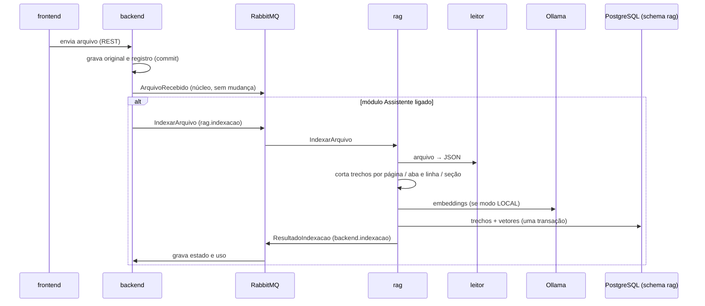
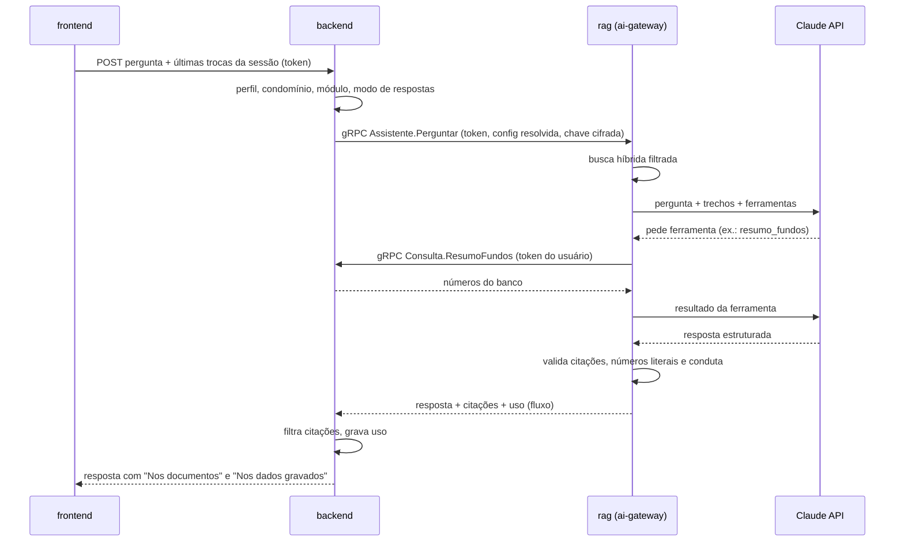

# ADR 0003: Assistente (chat, embeddings, busca) e módulos contratáveis por condomínio

- **Status:** aprovada pelo usuário em 03/10/2026 (todas as recomendações, incluindo Claude via API para as respostas do chat)
- **Complementa:** ADR 0001 (linhas "Modelo de IA" e "RAG e MCP") e ADR 0002 (tabela "Como conversam": acrescenta canais, não muda os existentes)
- **Requisitos atendidos:** RF-04 (Assistente), RF-08.1, RF-09.3, RF-09.6, RF-09.7, RF-10 (módulos), com as respostas do usuário Q7 a Q17 de 03/10/2026 (Q10 = Não; demais = Sim)

## Contexto

O usuário pediu um chat sobre os documentos (estilo NotebookLM) e decidiu que ele é um **módulo contratável** por condomínio (RF-10), com **modo de IA próprio** separado para respostas e para embeddings (RF-09.6) e **registro de uso** para cobrança futura (RF-09.7, RF-10.6).

Respostas do usuário que moldam esta ADR: busca por palavra sem IA em todos os modos (Q7), parte do módulo (Q13); valor de documento só como transcrição literal "não conferido" (Q8); localização página / aba e linha / seção ou parágrafo (Q9); histórico **só na sessão** (Q10 = Não); termos de conduta proibidos (Q11); **embeddings locais permitidos** em `MCP_EXTERNO` e `DESLIGADO` (Q12); índice guardado ao desligar o módulo (Q14); condomínio novo começa sem o módulo (Q15); MCP responde com IA desligada (Q16); Admin vê o uso do próprio condomínio (Q17).

Estado real do código (03/10/2026):
- `rag`: sem banco e sem Spring AI; consome `rag.arquivos-recebidos`, chama o leitor e só interpreta o Fluxo de Caixa. Não indexa texto.
- `mcp`: 5 ferramentas gRPC (`listar_condominios`, `resumo_fundos`, `listar_arquivos`, `conferencias_do_arquivo`, `buscar_lancamentos`).
- `backend`: schema `backend`; tabela `arquivo` ainda sem competência, versão e exclusão lógica.
- Não existe catálogo de módulos nem configuração de IA por condomínio.
- Leitor v1: Word sai como parágrafos numerados, **sem marcação de título**; a "seção" do Q9 exige uma versão nova do contrato do leitor.

Fato técnico que pesa: **o Claude não gera embeddings**. A busca por significado precisa de outro modelo, local ou de outro fornecedor (a Anthropic indica a Voyage AI).

São cinco decisões. Cada uma tem opções, prós e contras e recomendação. O usuário aprova ou troca cada uma separadamente.

---

## Decisão 1: IA que redige as respostas do chat

Em qualquer opção, a chamada fica **no `rag`, atrás do ai-gateway** (RF-09.3): só ele fala com modelos, lê o modo efetivo, registra tokens e, na nuvem, aplica o mascaramento LGPD.

| Opção | Prós | Contras |
|---|---|---|
| **A. Claude via API, com a chave do condomínio** (modo `API_KEY`) | Melhor qualidade em português, documentos longos, uso de ferramentas e saída estruturada, que é o que a citação obrigatória e a separação "Nos documentos" / "Nos dados gravados" exigem. Starter oficial no Spring AI 2.0.1 (BOM já no catálogo). Cada condomínio paga a sua IA (RF-09.2) | O texto dos trechos sai da máquina para a Anthropic. Custo por pergunta. Exige chave cadastrada |
| B. Modelo local (modo `LOCAL`, ex.: Qwen ou Gemma pelo Ollama) | Nada sai da máquina; sem custo por chamada | Precisa de GPU ou muita memória para responder em tempo útil. Qualidade bem inferior em uso de ferramentas e em seguir regras de citação e conduta; mais casos reprovados no conjunto de avaliação (RF-04.19) |
| C. Só pelo MCP (modo `MCP_EXTERNO`, sem chat na tela) | Zero custo para o sistema; o Claude Desktop ou Code do usuário já funciona com as ferramentas | Sem chat na tela: só quem tem Claude e sabe conectá-lo usa. Conselheiros e moradores ficam só com a busca por palavra |

**Recomendação: A**, com o **catálogo de provedores por configuração** que o RF-09.6 pede, de modo que B e C continuem disponíveis por condomínio sem código novo:

- O catálogo fica na configuração do `rag` (quem conhece as implementações). Cada entrada: código do provedor, tipo (`anthropic`, `ollama`), modelos permitidos, uso (respostas ou embeddings), dimensão (embeddings), preço por milhão de tokens de entrada e de saída (para custo estimado) e se precisa de chave.
- Catálogo inicial proposto: `anthropic` com os modelos Sonnet (padrão das respostas) e Haiku 4.5 (opção mais barata), IDs exatos na configuração. `ollama` entra no catálogo só quando o usuário aprovar o modo `LOCAL` para respostas.
- Acrescentar provedor de um **tipo já implementado** é só configuração. Um **tipo novo** (outro fornecedor) é código e exige ADR.
- O backend obtém o catálogo do `rag` por gRPC (Decisão 5) para mostrar as opções ao Admin e validar o que é salvo.

Como o chat garante as regras do RF-04 (vale para qualquer opção):
- O modelo recebe só os trechos recuperados (com `trechoId`) e as ferramentas numéricas; a saída é JSON validado por esquema: blocos `nosDocumentos` (texto com `trechoId`s citados) e `nosDadosGravados` (referência à chamada de ferramenta).
- **Os números do bloco "Nos dados gravados" são escritos pelo `rag` a partir do resultado da ferramenta**, nunca copiados do texto do modelo (RF-04.13, RF-04.14).
- Validação depois da resposta: toda citação existe entre os trechos recuperados, do mesmo condomínio; todo número em "Nos documentos" aparece literalmente no trecho citado e sai marcado "conforme o documento, não conferido" (Q8); nenhum termo da lista de conduta fora de citação literal (Q11). Falhou: uma nova tentativa; falhou de novo: "não encontrei nos documentos" (RF-04.12).
- Prompts versionados no `rag`; a versão vai no registro de uso.
- Histórico só na sessão (Q10 = Não): o **frontend** guarda a conversa e manda as últimas trocas junto com cada pergunta (limite por configuração). Backend e `rag` não guardam conversa.

---

## Decisão 2: modelo de embeddings (busca por significado)

O mesmo modelo precisa gerar os vetores dos trechos e o da pergunta; trocar de modelo obriga a reindexar. A coluna de vetor do PostgreSQL tem dimensão fixa.

| Opção | Prós | Contras |
|---|---|---|
| **A. Local, no contêiner Ollama, modelo `bge-m3`** (1024 dimensões, 8 mil tokens de contexto, mais de 100 idiomas, licença MIT, cerca de 1,2 GB) | Nada sai da máquina, sem custo por uso, funciona em **todos** os modos (Q12). Um só espaço de vetores para todos os condomínios. As réplicas do `rag` ficam leves (o modelo roda num contêiner só). O mesmo Ollama serve o futuro modo `LOCAL` de respostas. Spring AI 2.0.1 tem `OllamaEmbeddingModel` | Um contêiner a mais e o download do modelo na primeira subida (fica num volume). Indexar milhares de páginas em CPU leva tempo (é trabalho de fila, não trava a tela). Qualidade um pouco abaixo dos modelos pagos |
| B. Local, dentro do próprio Java (ONNX, `spring-ai-transformers`), modelo multilíngue como `multilingual-e5-base` (768 dimensões) | Nenhum contêiner a mais | Cada réplica do `rag` carrega o modelo na memória (centenas de MB a mais de 2 GB). Exige converter o modelo para ONNX e acertar o modo de agregação dos vetores (o `bge-m3` usa o vetor do primeiro token; o padrão do Spring AI é a média, o que piora a busca sem aviso). O modelo padrão do Spring AI (`all-MiniLM-L6-v2`) é só inglês |
| C. Voyage AI pela API (`voyage-4`, 1024 dimensões, multilíngue) | Melhor qualidade de busca; sem carga na máquina. A família Voyage 4 tem um modelo aberto (`voyage-4-nano`, Apache 2.0) no **mesmo espaço de vetores**, o que permitiria indexar local e perguntar pela API | É **outro fornecedor e outra chave** (a chave do Claude não serve). O texto de todos os documentos sai da máquina na indexação, inclusive em condomínios `MCP_EXTERNO` ou `DESLIGADO`, o que contraria o espírito do Q12. O `voyage-4-nano` roda em Python (sentence-transformers ou vLLM), o que traria mais um serviço Python. Sem integração pronta no Spring AI 2.0.1 (seria um cliente HTTP próprio) |

**Recomendação: A.** Embeddings locais, um modelo para a instalação inteira, em todos os modos. Detalhes:
- Modo de embeddings do assistente (RF-09.6): `LOCAL` (padrão, inclusive quando o modo geral é `MCP_EXTERNO` ou `DESLIGADO`, pelo Q12) ou `DESLIGADO` (só busca por palavra). `API_KEY` para embeddings fica previsto no catálogo, mas sem provedor até o usuário aprovar um (ex.: opção C).
- Todo modelo de embeddings do catálogo precisa ter **1024 dimensões** (o `bge-m3`, o `voyage-4` e o `qwen3-embedding` aceitam). Cada vetor guarda o modelo que o gerou; trocar o modelo de um condomínio reindexa só aquele condomínio.
- O modelo é baixado por um passo de inicialização do compose para um volume; depois disso, roda sem internet. `docker compose up` continua sendo um comando só (RNF-01).
- B fica como plano reserva se o contêiner extra for problema; C, como opção futura de qualidade, com ADR própria.

---

## Decisão 3: como a busca funciona e onde o índice fica

| Opção | Prós | Contras |
|---|---|---|
| **A. Híbrida, SQL próprio no schema `rag`: pgvector + busca por palavra do PostgreSQL em português** | Um banco só (já decidido na ADR 0001). Filtro de condomínio, categoria, período, documento e versão vigente no `WHERE` **antes** da busca (RF-04.3). A parte por palavra funciona sozinha, sem IA (Q7). Controle total da localização para as citações | Mais SQL para manter (poucas consultas, testáveis) |
| B. `PgVectorStore` do Spring AI | Pronto, menos código | Tabela genérica com metadados em JSON; sem busca por palavra em português; filtros por expressão sobre JSON, mais lentos e mais difíceis de garantir "filtro antes"; a busca por palavra teria de ser feita à parte de qualquer jeito |
| C. Motor de busca dedicado (OpenSearch ou Elasticsearch) | Busca textual muito rica | Mais um contêiner pesado e uma segunda cópia dos dados para sincronizar; exagero para o volume previsto |

**Recomendação: A.**

**Tabelas no schema `rag`** (só dados processados; reconstruíveis a partir de `dados/`, seção 2.1 da arquitetura):
- `documento_indexado`: arquivo, condomínio, categoria, competência (início e fim, quando houver), versão, sha256, nome, estado (`na_fila`, `indexando`, `indexado`, `sem_texto`, `erro`), motivo, páginas, trechos, modelo de embeddings, versão do indexador, `vigente`, `retirado`, data.
- `trecho`: arquivo, condomínio, ordem, localização (`pagina`; ou `aba` + `linha_inicio`/`linha_fim`; ou `secao` + `paragrafo_inicio`/`paragrafo_fim`), texto, e coluna de busca por palavra gerada com uma configuração de texto **português sem acento** (`portuguese` + dicionário `unaccent`, extensão que já vem com o PostgreSQL), com índice GIN.
- `trecho_vetor`: trecho, modelo, vetor `vector(1024)`, índice HNSW por cosseno (um índice parcial por modelo). Se o volume crescer muito, `halfvec` corta o espaço pela metade sem mudar o desenho.

**Busca:**
- Por palavra: `websearch_to_tsquery` (aceita "frase entre aspas" e exclusão com `-`), ordenada por relevância. É a "Busca nos documentos" da tela e o que sobra quando os embeddings estão desligados.
- Híbrida (chat e `buscar_documentos`): as duas buscas, cada uma com o mesmo filtro, até 50 resultados cada, unidas por **fusão de posições** (Reciprocal Rank Fusion, k = 60), devolvendo os 8 a 12 melhores. Determinística para o mesmo índice e a mesma pergunta.
- Sempre filtra `vigente = true` e `retirado = false` (RF-04.5, exclusão lógica). O backend ainda descarta, na volta, qualquer citação de arquivo que o usuário não possa ver (segunda barreira).
- Com filtro muito seletivo, o índice HNSW pode devolver menos resultados que o pedido: usar a varredura iterativa do pgvector 0.8 (`hnsw.iterative_scan`), conferindo a versão da imagem `pgvector/pgvector:pg17` na implementação.

**Corte dos trechos (chunking) pela localização do Q9**; um trecho nunca atravessa página, aba ou seção, para a citação ser exata:
- PDF: por página; página longa vira mais de um trecho (cerca de 800 tokens, com sobreposição pequena), todos com a mesma página.
- Excel: por aba, blocos de linhas (ex.: 30), repetindo a linha de cabeçalho; localização = aba e linha inicial e final.
- Word: por seção (título) e grupo de parágrafos até o limite de tamanho; localização = seção e parágrafos. **Depende de `contracts/leitor/v2`** com o estilo do parágrafo (título e nível). Até lá, a localização é só o número do parágrafo.
- PDF sem texto: estado `sem_texto` com motivo, sem trechos (RF-04.4; OCR depende do Q1).
- Alternativas descartadas: corte por tamanho fixo atravessando páginas (citação imprecisa) e corte feito por IA (custo e não determinístico).

---

## Decisão 4: onde fica o estado do módulo e o modo de IA, e como cada serviço o consulta

| Opção | Prós | Contras |
|---|---|---|
| **A. O `backend` é o dono** do catálogo de módulos, do estado por condomínio, da trilha de ativação, da configuração de IA e do registro de uso. Os outros serviços **não consultam estado**: o frontend lê por REST; o `mcp` não precisa saber (o backend recusa); o `rag` só age quando recebe um pedido, que já vem com a configuração resolvida | Uma fonte da verdade, uma trilha, um lugar para relatórios e Excel (POI já está no backend). Nada de cópias para sincronizar entre serviços. Ligar e desligar vale no próximo pedido, sem reinício (RF-10.2). Respeita a ADR 0002 | O backend vira passagem obrigatória do chat e da busca (já é, pela ADR 0002) |
| B. Serviço novo de "plataforma" (catálogo, licenças, uso) | Separa o comercial do contábil | Mais um serviço, banco e contrato antes de existir um segundo módulo |
| C. Módulos como atributos no Keycloak (vão no token) | Todo serviço lê do token, sem chamada | Só muda após novo login (contraria RF-10.2); trilha append-only e períodos ativos teriam de ficar em outro lugar; mistura contrato comercial com identidade |

**Recomendação: A.** Como fica:

**No schema `backend`:**
- **Catálogo de módulos** em arquivo de configuração versionado no backend (código, nome, descrição, o que inclui, dependências, estado padrão). Hoje: só `ASSISTENTE`, padrão **desligado** para condomínio novo (Q15); a migração liga para o piloto. Um módulo novo é uma entrada no catálogo e a verificação nos pontos que ele inclui (RF-10.1).
- `modulo_condominio` (estado atual) e `evento_modulo` (trilha **só de inserção**: condomínio, módulo, estado anterior e novo, quem, quando, motivo). Os **períodos ativos** saem por consulta sobre a trilha (RF-10.6). A trilha é protegida no banco contra `update` e `delete`.
- `configuracao_ia`: modo geral do condomínio e, por módulo e função (`ASSISTENTE/respostas`, `ASSISTENTE/embeddings`), modo, provedor, modelo e chave cifrada; ausência de linha = herda o modo geral (RF-09.6). Toda mudança vai para a trilha de auditoria (RF-07.4), nunca com a chave.
- `uso_modulo` (só de inserção): condomínio, módulo, função (`pergunta`, `embeddings`, `busca_palavra`, `chamada_mcp`, `indexacao`), usuário, data e hora, modo, provedor, modelo, versão do prompt, tokens de entrada e saída, arquivos e páginas indexados. **O custo não é gravado por registro**: é calculado no relatório do período (tokens × preço do catálogo, `BigDecimal`, arredondado para 2 casas só no total), o que evita valores abaixo de um centavo e mantém o cálculo determinístico. Nunca guarda chave nem texto de documento (RF-09.7).

**Quem consulta e como (sem ler o banco de ninguém):**

| Serviço | Como sabe | Contrato |
|---|---|---|
| frontend | `GET /condominios/{id}/contexto` devolve módulos ligados e o modo efetivo do assistente (sem chave). O menu "Assistente" depende disso; recarregar a tela reflete a mudança | `contracts/openapi.yaml` |
| backend | Lê as próprias tabelas em todo endpoint e rpc do módulo (uma verificação central, ex.: anotação `@ExigeModulo("ASSISTENTE")`); recusa com "módulo Assistente não contratado para este condomínio" (RF-10.3) | — |
| mcp | Não consulta. `buscar_documentos` chama o backend, que recusa com status gRPC `FAILED_PRECONDITION` e a mesma mensagem; o `mcp` repassa. As ferramentas do núcleo continuam iguais | `contracts/grpc/consulta/v1` |
| rag | Não consulta. Só indexa quando recebe `IndexarArquivo`; só responde quando recebe `Perguntar` ou `Buscar`. Cada pedido traz o modo, o provedor, o modelo e a chave cifrada já resolvidos pelo backend | `contracts/mensagens/v1`, `contracts/grpc/assistente/v1` |

**Sub-decisão 4.1: a chave de API do condomínio**

| Opção | Prós | Contras |
|---|---|---|
| **A. O backend guarda a chave cifrada com a chave pública do `rag`** (envelope RSA-OAEP + AES-256-GCM, só com a biblioteca padrão do Java). Só o `rag` tem a chave privada (variável de ambiente ou segredo do Docker; cofre ou KMS na nuvem) | O backend guarda, mas **não consegue ler** a chave; a configuração inteira fica num lugar só; o `rag` decifra só na hora da chamada | Um par de chaves para gerar e guardar na instalação (passo documentado; o compose gera um par de desenvolvimento) |
| B. O `rag` guarda as chaves no próprio schema; o backend só guarda "chave cadastrada: sim" | A chave mora onde é usada | Configuração dividida entre dois serviços; o backend precisa de mais um rpc para salvar e conferir |
| C. Uma chave simétrica igual no backend e no `rag` | Simples | Os dois serviços conseguem ler a chave do cliente |

**Recomendação: A.** Ao salvar, o backend cifra na hora, nunca devolve a chave e mostra só os quatro últimos caracteres.

---

## Decisão 5: fluxos novos

### 5.1 Indexação pela fila

| Opção | Prós | Contras |
|---|---|---|
| **A. Fila própria `rag.indexacao`**, consumida pelo `rag` com paralelismo separado | A leitura contábil (núcleo) não espera os embeddings; "Reindexar todos" e ligar o módulo usam o mesmo caminho; estado de indexação separado do estado de leitura (RF-04.7); módulo desligado = nenhuma mensagem (RF-10.3) | O `rag` chama o leitor de novo para o mesmo arquivo (o leitor é sem estado e rápido; custo pequeno) |
| B. Indexar no mesmo consumidor de `rag.arquivos-recebidos`, logo depois de publicar o resultado | Lê o arquivo uma vez só | Arquivo grande atrasa a fila do núcleo; reindexar sem reler o núcleo exigiria outro caminho de qualquer jeito |

**Recomendação: A.** Funcionamento:
- O backend publica `IndexarArquivo` (depois do commit, como na ADR 0002) quando o módulo está ligado: no envio, no reprocesso, na nova versão, em "Reindexar todos" (RF-04.6) e para todos os arquivos ao **ligar** o módulo (RF-10.4). A mensagem traz arquivo, condomínio, categoria, competência, versão, nome, caminho, sha256, `indexacaoId` e o modo e modelo de embeddings resolvidos.
- Operação `RETIRAR` na mesma fila para exclusão lógica e para a versão substituída (marca `retirado` ou `vigente = false`; não apaga, a trilha continua rastreável).
- **Idempotência e Q14:** se já existe índice com o mesmo arquivo, sha256, modelo e versão do indexador, o `rag` só confirma `INDEXADO` sem refazer. Por isso, religar o módulo só indexa o que é novo ou mudou. Reindexar de verdade substitui os trechos do arquivo numa transação (RF-04.5).
- O `rag` publica `ResultadoIndexacao` (`INDEXANDO`, `INDEXADO` com páginas e trechos, `SEM_TEXTO` com motivo, `ERRO` com motivo) na fila `backend.indexacao`. O backend grava o estado (tela Arquivos) e o registro de uso `indexacao`. Mesmas regras de retentativa, fila `.erro` e varredura da ADR 0002, com `indexacaoId` no papel do `processamentoId`.
- **Desligar o módulo** não apaga nada (Q14): o backend para de publicar e recusa buscas; o índice fica guardado e inacessível.

### 5.2 Chat: frontend → backend → rag

| Opção | Prós | Contras |
|---|---|---|
| **A. gRPC síncrono backend → rag**, novo serviço `Assistente`, com resposta em fluxo (stream) | Mesmo padrão já aprovado na ADR 0002 (biblioteca e plugin já no catálogo); contrato forte; o fluxo permite mandar andamento e texto parcial | O `rag` passa a ter servidor gRPC |
| B. REST backend → rag | Simples de depurar | Contrato a mais em outro formato (OpenAPI interno); sem fluxo nativo |
| C. Pergunta e resposta pela fila RabbitMQ | Reaproveita a fila | Ruim para uso interativo (o usuário espera na tela); correlação de resposta trabalhosa |

**Recomendação: A.** Contrato `contracts/grpc/assistente/v1/assistente.proto` com: `Perguntar` (resposta em fluxo: andamento, texto parcial, resposta final com blocos e citações, uso), `Buscar` (busca por palavra ou híbrida, devolve trechos citáveis) e `ListarProvedores` (catálogo). No MVP o backend junta o fluxo e devolve a resposta inteira ao frontend em JSON; mostrar o texto chegando na tela (SSE) fica para depois sem mudar o contrato gRPC.

**Os números do chat** (RF-04.13): durante a pergunta, o `rag` chama as ferramentas numéricas no backend pelo **mesmo** `contracts/grpc/consulta/v1` que o `mcp` usa, **com o token do próprio usuário** (o backend repassa o token no metadado `authorization`, como o `mcp` faz). O backend aplica perfil e condomínio do mesmo jeito. Há uma ida e volta (backend → rag → backend) dentro da mesma pergunta: não trava porque a API REST e o servidor gRPC do backend usam grupos de threads diferentes, e toda chamada tem prazo (deadline) configurável.

Quem verifica o quê na pergunta:
1. Backend: token, perfil e condomínio (RF-04.3); módulo ligado (RF-10.3); modo de respostas do assistente. `MCP_EXTERNO` ou `DESLIGADO` = recusa com a mensagem do RF-04.16, **sem chamar o `rag`**.
2. Rag: busca híbrida filtrada, chamada ao modelo com ferramentas, validação da resposta (Decisão 1), uso devolvido.
3. Backend: descarta citações de arquivos que o usuário não pode ver, grava `uso_modulo` e responde.

### 5.3 Ferramenta MCP `buscar_documentos`

`mcp` → backend (novo rpc `BuscarDocumentos` em `contracts/grpc/consulta`) → backend verifica token, condomínio e módulo, registra uso `chamada_mcp` → `rag.Buscar`. Funciona em **qualquer modo de IA**, inclusive `DESLIGADO` (Q16): usa a busca híbrida quando os embeddings estão em `LOCAL` e só a busca por palavra quando estão desligados. Mesmos filtros e mesmas citações da tela (RF-04.17). Se o rpc entra como acréscimo compatível em `consulta/v1` ou numa `v2` é decisão do agente `mcp`.

### 5.4 Diagramas

---

## Novas peças (aprovadas pelo usuário em 03/10/2026)

| Peça | Onde | Por quê | Situação no projeto |
|---|---|---|---|
| `spring-ai-starter-model-anthropic` (Spring AI 2.0.1) | rag | Decisão 1 A | **Nova** (o BOM do Spring AI já está no catálogo) |
| `spring-ai-starter-model-ollama` (Spring AI 2.0.1) | rag | Decisão 2 A | **Nova** |
| Imagem `ollama/ollama` (versão fixada na implementação) + modelo `bge-m3` num volume | infra | Decisão 2 A | **Novo contêiner** |
| Extensões `vector` e `unaccent` no schema `rag` | banco | Decisão 3 A | `pgvector` já está na imagem; `unaccent` vem com o PostgreSQL |
| `spring-boot-starter-jdbc` (ou data-jdbc), `spring-boot-starter-flyway`, `flyway-database-postgresql`, driver `postgresql` | rag | Schema `rag` (previsto na ADR 0002) | Já usados no backend; novos no rag |
| `spring-boot-starter-oauth2-resource-server`, `grpc-netty-shaded`, `libs/contrato-grpc` | rag | Validar o token e falar gRPC | Já usados no backend e no mcp; novos no rag |

Não entram: `PgVectorStore` do Spring AI (Decisão 3 B), biblioteca Java do pgvector (o vetor vai como texto convertido no SQL), SDK da Voyage, `spring-ai-transformers` (só se o usuário escolher a Decisão 2 B).

## Novos contratos (validados pelo agente `mcp`, os dois lados no mesmo PR)

- `contracts/mensagens/v1/indexar-arquivo.schema.json` (backend → rag, fila `rag.indexacao`) e `resultado-indexacao.schema.json` (rag → backend, fila `backend.indexacao`). Tipos novos; as mensagens existentes não mudam.
- `contracts/grpc/assistente/v1/assistente.proto` (backend → rag): `Perguntar`, `Buscar`, `ListarProvedores`.
- `contracts/grpc/consulta`: rpc `BuscarDocumentos` (mcp → backend). O `rag` passa a ser cliente de `Consulta`.
- `contracts/leitor/v2`: estilo do parágrafo no Word (título e nível) para a "seção" do Q9.
- `contracts/openapi.yaml`: contexto do condomínio (módulos e modo), pergunta, busca, reindexar todos, configuração de IA do assistente (chave só de escrita), uso do condomínio (Admin, Q17), e, para o Super-admin, catálogo, ligar e desligar com motivo, períodos ativos e uso em Excel.

## Consequências

- O `rag` ganha banco (schema `rag`), servidor gRPC e cliente gRPC. Continua sem ler o schema do backend e sem regra contábil.
- A tabela "Como conversam" da ADR 0002 ganha três linhas: backend → rag (`Assistente`, gRPC), rag → backend (`Consulta`, gRPC com o token do usuário) e backend ↔ rag (filas de indexação).
- Mais um contêiner (Ollama) e cerca de 1,2 GB de modelo; a indexação em CPU é mais lenta que a leitura, mas corre na fila e escala com réplicas do `rag` e paralelismo da fila.
- Todo número continua vindo do banco por ferramenta; o modelo só redige e cita.
- Avaliação (RF-04.19): a parte de **busca** roda a cada mudança com o Ollama e o `bge-m3` no ambiente de teste (determinística); a parte de **resposta redigida** roda sob demanda com uma chave de API de desenvolvimento guardada como segredo, nunca a de um condomínio.
- Nuvem: a chave privada do `rag` vai para o cofre ou KMS; o mascaramento LGPD entra no ai-gateway antes da chamada ao Claude; embeddings locais continuam não enviando texto para fora.

## Tarefas por agente (depois da aprovação)

| Agente | Tarefa | Critério de aceite |
|---|---|---|
| `mcp` | Escrever os contratos acima e os testes de contrato dos dois lados | Exemplos de cada mensagem e rpc validam nos dois serviços; mudança sem o outro lado quebra o build |
| `backend` | Catálogo, `modulo_condominio`, trilha append-only, `configuracao_ia` com chave cifrada, `uso_modulo`, endpoints e rpcs, publicação de `IndexarArquivo`/`RETIRAR` | RF-10.2 a 10.6, RF-09.6 e 09.7 com os critérios do `requisitos.md`; `update`/`delete` na trilha recusados pelo banco |
| `ingestao` | Leitor v2 (estilo do parágrafo no Word) e corte dos trechos por localização | Golden files sem piora; PDF de 12 páginas gera trechos para as 12 páginas com texto (RF-04.4) |
| `rag` | Schema `rag`, consumidor `rag.indexacao`, embeddings via Ollama, busca híbrida, ai-gateway com catálogo, `Perguntar` com validação de citações, números e conduta | RF-04.2, 04.3, 04.5, 04.12 a 04.15 e 04.19 (parte de busca) passando |
| `mcp` | Ferramenta `buscar_documentos` e testes ponta a ponta | RF-04.17: mesma pergunta pela tela e pelo MCP devolve os mesmos trechos; recusa sem módulo ou sem acesso |
| `frontend` | Tela "Assistente" nos quatro estados do RF-04.16, busca por palavra, estado de indexação na tela Arquivos, administração de módulos e uso | Critérios do RF-04.7, 04.8 a 04.11 e 04.16 |

## Perguntas para o usuário (Sim/Não, uma por decisão)

1. Decisão 1: IA das respostas = **Claude via API** com a chave do condomínio (A)? (já está no cartão: Claude / Local / MCP)
2. Decisão 2: embeddings **locais** com Ollama e `bge-m3` para todos os modos, com um contêiner a mais (A)?
3. Decisão 3: busca **híbrida em SQL próprio** no schema `rag` (A)?
4. Decisão 4: **backend dono** de módulos, configuração de IA e uso (A)?
5. Sub-decisão 4.1: chave do condomínio **cifrada com a chave pública do `rag`** (A)?
6. Decisão 5.1: **fila própria** de indexação (A)?
7. Decisão 5.2: chat por **gRPC** backend → rag, com o `rag` consultando os números no backend com o token do usuário (A)?

## Fontes consultadas

- Voyage AI, modelos de texto (família 4, dimensões, `voyage-4-nano` aberto): https://www.mongodb.com/docs/voyageai/models/text-embeddings/ e https://huggingface.co/voyageai/voyage-4-nano
- Ollama, `bge-m3`: https://ollama.com/library/bge-m3 ; `qwen3-embedding`: https://registry.ollama.ai/library/qwen3-embedding
- Spring AI 2.0.1, `OllamaEmbeddingModel`: https://docs.spring.io/spring-ai/docs/2.0.1/api/org/springframework/ai/ollama/OllamaEmbeddingModel.html
- Spring AI, embeddings ONNX (Transformers): https://docs.spring.io/spring-ai/reference/api/embeddings/onnx.html

Mudar qualquer item exige nova ADR aprovada pelo usuário.
