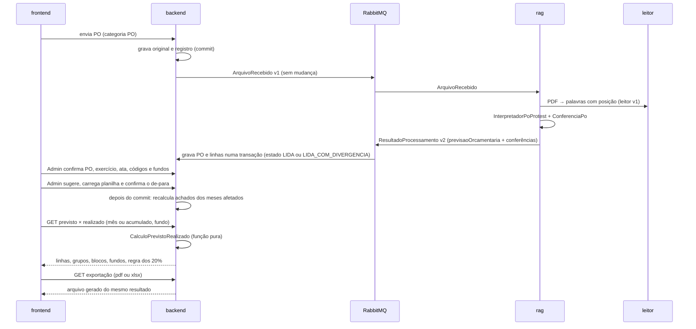
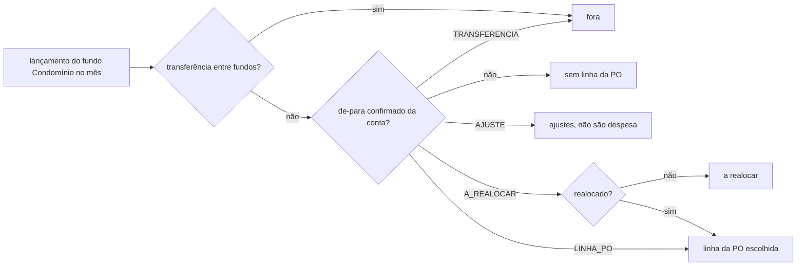

# ADR 0004: Previsto × realizado (leitura da PO, de-para, cálculo e exportação)

- **Status:** aprovada pelo usuário em 04/10/2026 (todas as recomendações, perguntas 1 a 10)
- **Complementa:** ADR 0002 (acrescenta a versão 2 da mensagem `ResultadoProcessamento`; não muda filas nem canais) e ADR 0001 (passa a usar Thymeleaf, OpenHTMLtoPDF e Apache POI, já aprovados, que ainda não estão no build)
- **Requisitos atendidos:** RF-03.1.1 a RF-03.1.15 (detalham RF-00.8, RF-02B.4, RF-03.1, RF-05.6, RF-06.1 e o §8, item 5), com as respostas do usuário Q18 a Q26 de 04/10/2026
- **Não decide (fica para requisito próprio, como no RF-03.1):** ferramenta MCP de previsto × realizado (RF-08.1), PO de outras administradoras (RF-00.5), projeção e "Criar nova PO" (RF-03.3 a RF-03.5), auditoria de energia, água e gás

## Contexto

O usuário pediu: ler a PO aprovada, ligar cada conta do fluxo a uma linha da PO (de-para) e mostrar, mês a mês e por fundo, o previsto contra o realizado. O caso de aceite é setembro/2026 do piloto (RF-03.1.15).

O bloco "Fora destes requisitos" do RF-03.1 deixa seis pontos para esta ADR: (1) serviço e técnica de leitura da PO; (2) onde ficam a PO lida, o de-para e o resultado; (3) contrato entre serviços para a PO lida; (4) método da sugestão automática; (5) quando o cálculo roda; (6) técnica de PDF, Excel e gráficos.

Estado real do código (04/10/2026, branch `main`):
- `leitor` (Python, pdfplumber): devolve cada página do PDF com as palavras e as coordenadas (`contracts/leitor/v1`). Não reconhece tabelas.
- `rag`: sem banco. Consome `rag.arquivos-recebidos`, chama o leitor e reconhece só o Fluxo de Caixa da Protest (`InterpretadorFluxoCaixa`, pelas coordenadas das palavras). Confere as somas e enriquece (meio de pagamento, transferência entre fundos). O arquivo da categoria PO é guardado, mas não é lido.
- `backend`: grava o resultado numa transação (`GravacaoResultado`), apaga a extração anterior do arquivo e insere a nova. Por isso **o `id` do lançamento muda a cada reprocesso**. Já tem o fundo ordinário confirmado pelo Gestor (`condominio.fundo_ordinario_id`, migração V5), que é o "fundo Condomínio" do RF-03.1.6. Ainda não existem tabelas de achado, de trilha de auditoria (RF-07.4) nem de realocação (RF-02B).
- `contracts/mensagens/v1/resultado-processamento.schema.json` tem `additionalProperties: false` e `versao: 1`. Acrescentar um campo quebra o consumidor antigo.
- `frontend`: já usa o Recharts (opção aprovada no T2 de `docs/tecnologias.md`) no gráfico da tela inicial.
- Thymeleaf, OpenHTMLtoPDF e Apache POI estão aprovados (ADR 0001), mas nenhum deles está no build.

Fatos conferidos nos arquivos do piloto, que pesam no desenho:
- A PO (`PO-2026-2027-aprovada.pdf`) é um PDF digital de **uma página**, com texto. Colunas: Item, Identificação (conta da PO ou marca como "Rateio à parte"), Descrição, Orçado 2025/2026, Orçado 2026/2027, %, Observações. Alguns valores vêm **sem separador de milhar** (`1585,14`, `1189,16`, `1518,93`), diferente do fluxo. O código `1.3.2` aparece duas vezes. Linhas de grupo trazem "Subtotal (soma linhas X a Y)" na coluna de conta.
- A **mesma conta da PO aparece em mais de uma linha** (ex.: 1606 em 1.3.5 e 1.7.2; 1693 em 1.3.7 e 1.8.1; 1624 em 1.3.2 e 1.8.8). O destino do de-para é a **linha** da PO (pelo identificador interno), nunca a conta.
- No fluxo de setembro, **todos os créditos** do "FUNDO DE RESERVA" são lançamentos "RECIBOS ACUMULADOS" e somam **14.260,79** (páginas 14 e 21). No fundo "OBRAS / REFORMAS / INFRA", os "RECIBOS ACUMULADOS" somam **9.705,06** (páginas 19, 20 e 22). Esses são os valores do RF-03.1.9 e resolvem o conflito 4 a favor da análise manual. O 13.087,65 da implantação era uma estimativa.
- Existem dois fundos com "OBRAS" no nome: "OBRAS" (só uma transferência de 25,13) e "OBRAS / REFORMAS / INFRA". Ligar o fundo à linha 1.9.2 pelo nome erraria. A ligação tem de ser confirmada.

São oito decisões. Cada uma traz opções, prós e contras e uma recomendação. O usuário aprova ou troca cada uma em separado (seção "Perguntas para o usuário").

---

## Decisão 1: em qual serviço e com qual técnica a PO é lida

| Opção | Prós | Contras |
|---|---|---|
| **A. No `rag`, novo interpretador `InterpretadorPoProtest` (pacotes `rag.leitura.po` e `rag.dominio.po`), pelas coordenadas das palavras do leitor v1**, como já é feito com o fluxo | Mesma técnica, já testada no fluxo. Determinística, sem IA (funciona em `DESLIGADO`). **O leitor e o contrato do leitor não mudam.** A conferência das somas fica no `rag`, como a do fluxo (ADR 0002: o rag "confere as somas") | Mais um interpretador para manter por layout. Coluna larga encostando na vizinha (ex.: 1.3.22) exige atenção aos limites das colunas |
| B. Extração de tabela no `leitor` (`pdfplumber.extract_tables`), com o `rag` só mapeando colunas | Menos código de coordenadas no Java | Muda o contrato do leitor (`contracts/leitor/v2`) para um caso só. A PO não tem linhas de grade confiáveis: a detecção de tabela do pdfplumber depende de linhas ou de ajuste fino por documento. Põe conhecimento de layout no leitor, que não deve ter regra |
| C. Extração por IA (Claude com saída estruturada) | Serve para layouts novos sem código | Não determinística; não funciona em `DESLIGADO` (contraria RF-00.8); custo por leitura; a conferência teria de rejeitar as alucinações. Contraria o princípio "IA para entender, código para calcular" no item que é a base de todos os números |

**Recomendação: A.** Como funciona:
- **Reconhecimento:** título "PROPOSTA ORÇAMENTÁRIA" e cabeçalho com "ORÇADO" e "Observações" na primeira página. O processamento continua escolhendo o interpretador pelo conteúdo, como hoje. Quem decide se o resultado vale é o backend, pela categoria do arquivo (Decisão 3).
- **Colunas:** os limites saem das posições das palavras do cabeçalho de cada página, não de valores fixos. Valores são alinhados à direita: a palavra pertence à coluna onde termina (`x1`).
- **Tipos de linha:** `TOTAL` (código `1`), `GRUPO` (código com dois níveis, ex.: `1.3`), `LINHA` (três níveis). A linha guarda o código **como impresso** e a ordem de leitura. Assim o `1.3.2` repetido continua como duas linhas.
- **Marcas** (RF-03.1.1): "Rateio à parte", "Negociada isenção", "Sem valor" e "Valor fixo (sem referência)" na coluna de conta são lidas como marca, e não como conta. A linha 1.4.3 (Gás) traz "Débito em receitas eventuais" na coluna de conta e "Rateio à parte" só nas Observações. Regra: texto sem código numérico na coluna de conta nunca vira conta (fica como texto lido), e "Rateio à parte" nas Observações também dá a marca. Assim 1.4.1, 1.4.2, 1.4.3 e 1.6.15 saem com a marca, como pede o critério. A lista de textos é configuração do interpretador.
- **Dinheiro:** um conversor próprio da PO aceita `1.234,56` e `1234,56`, sempre `BigDecimal` com 2 casas. "%" e Observações saem como texto lido, sem conversão.
- **Conferência (`rag.dominio.po.ConferenciaPo`)**, cada uma com código, ok e detalhe (mesmo formato das conferências do fluxo): `SUBTOTAL_GRUPO` (uma por grupo, com as duas somas), `TOTAL` (soma dos grupos = total impresso), `PREVISTO_MES` (total − fundos), `CODIGO_REPETIDO` (lista os códigos). Os percentuais dos fundos (1.9.1 e 1.9.2) também saem como conferência informativa (3% e 2% de 451.620,13, a soma das linhas pela Q30).
- PDF escaneado (sem texto): falha legível, "PO sem texto; OCR ainda não disponível" (Q1).

---

## Decisão 2: contrato entre serviços para a PO lida

| Opção | Prós | Contras |
|---|---|---|
| **A. Nova versão `contracts/mensagens/v2/resultado-processamento.schema.json`**, na mesma fila `backend.resultados`: igual à v1, mais o bloco opcional `previsaoOrcamentaria` e o campo `recebimentoCota` no enriquecimento do lançamento | Um resultado por leitura, com o mesmo `processamentoId`, a mesma transação e as mesmas regras de retentativa da ADR 0002. O estado do arquivo (Iniciado, Concluído, Falhou) continua num lugar só. Segue a regra do `CLAUDE.md` (nova versão, os dois lados no mesmo PR) | O backend e o `rag` mudam juntos. A v1 fica em `contracts/` só como histórico |
| B. Mensagem nova `po-lida` na v1, numa fila própria `backend.po-lida` | Não toca na mensagem do fluxo | Duas mensagens para a mesma leitura: o arquivo poderia ficar "Concluído" sem a PO gravada. Mais uma fila, com retentativa e fila de erro |
| C. Acrescentar o campo na v1 | Nenhum arquivo novo | Quebra o `additionalProperties: false` e a regra de versões do projeto |

**Recomendação: A.** Conteúdo da v2 (o agente `mcp` escreve o JSON Schema e os exemplos):
- `versao: 2`. Tudo o que existe na v1 continua igual.
- `previsaoOrcamentaria` (nulo quando o arquivo não é PO): `titulo`, `exercicioImpresso` (texto, ex.: "2026 / 2027"), `colunasOrcado` (os rótulos impressos, ex.: "2025/2026" e "2026/2027") e `linhas[]`. Cada linha traz `ordem`, `pagina`, `tipo` (`TOTAL`, `GRUPO`, `LINHA`), `codigoImpresso`, `conta` (texto ou nulo), `marca` (enum ou nulo), `descricao`, `orcadoAnterior`, `orcado` (dinheiro como texto `"1234.56"`), `percentualTexto` e `observacoes`. As conferências vão no campo `conferencias`, que já existe.
- `lancamento.enriquecimento.recebimentoCota` (booleano, obrigatório na v2): verdadeiro para o crédito "RECIBOS ACUMULADOS" do layout Protest. É conhecimento de layout, como `meioPagamento`, e por isso fica no `rag` (Decisão 7).
- O hash e o arquivo de origem não vão na linha: o backend já os tem no registro do arquivo e os copia para cada linha gravada.
- **Corte da v1:** no mesmo PR, o `rag` passa a publicar só v2 e o backend passa a aceitar só v2. Mensagem v1 que ainda esteja na fila na hora da troca vai para a fila `.erro`, e a varredura de 15 minutos reenvia o arquivo, que volta como v2. Basta reprocessar os fluxos já gravados para preencher `recebimentoCota`.
- `contracts/leitor`: sem mudança. `contracts/grpc`: sem mudança.

---

## Decisão 3: onde ficam a PO lida, o de-para e o resultado

| Opção | Prós | Contras |
|---|---|---|
| **A. PO, de-para, ligação dos fundos, realocação e trilha no schema `backend`. O resultado do previsto × realizado não é gravado: é calculado na consulta (Decisão 5)** | O backend já é dono do contábil e do orçamento (ADR 0002). Os lançamentos, o fundo ordinário e as permissões já estão lá. Sem cópia de resultado para ficar velha | Mais tabelas no backend |
| B. PO lida guardada no `rag` (schema `rag`), com o backend consultando por gRPC | Mantém o "lido" perto de quem leu | O `rag` não tem banco hoje. Cria uma dependência síncrona backend → rag para todo cálculo. Contraria a ADR 0002, em que o rag devolve e o backend grava |
| C. Serviço novo "orçamento" | Separa o orçamento do contábil | Mais um serviço, schema e contrato para uma entrega que só lê dados do backend. A ADR 0002 já pôs o orçamento no backend |

**Recomendação: A.** Tabelas novas no schema `backend`, todas com `condominio_id`, dinheiro em `numeric(15,2)` e `BigDecimal` no Java. Migração Flyway na **próxima versão livre no main**:

| Tabela | Conteúdo | Observações |
|---|---|---|
| `previsao_orcamentaria` | arquivo, sha256, versão (1, 2, ... por condomínio e exercício), estado (`LIDA`, `LIDA_COM_DIVERGENCIA`, `CONFIRMADA`, `SUBSTITUIDA`), exercício (mês inicial e final), ata (arquivo da categoria ATA, ou nulo com `sem_ata = true`), total impresso, previsto do mês, quem confirmou e quando, versão do interpretador | Gravada pelo `GravacaoResultado` na mesma transação da leitura, **só se o arquivo é da categoria PO** (mesma regra do RF-01.7 para o fluxo). Reprocessar uma PO ainda não confirmada substitui as linhas; reprocessar uma PO confirmada é recusado ("crie uma nova versão") para não mudar números já exportados |
| `linha_po` | ordem, página, tipo, código impresso, **código efetivo** (igual ao impresso; o Admin muda só quando o código se repete), conta (texto), marca, descrição, orçado anterior, orçado, "%" texto, observações, arquivo e sha256 | Identificador interno estável: o de-para aponta para ele |
| `po_fundo` | versão da PO, linha 1.9.x, fundo do fluxo | Ligação do fundo de reserva e do de obras às linhas 1.9 (Decisão 7). O fundo Condomínio continua sendo o `fundo_ordinario_id` (V5) |
| `depara_conta` | versão da PO, conta do fluxo (código e nome como impressos no fluxo), tipo de destino (`LINHA_PO`, `AJUSTE`, `A_REALOCAR`, `TRANSFERENCIA`), linha da PO (quando `LINHA_PO`), estado (`SUGERIDO`, `CONFIRMADO`, `RECUSADO`), origem da sugestão (`VERSAO_ANTERIOR`, `NOME`, `PLANILHA`) e motivo | Único por versão da PO e conta do fluxo, o que garante "exatamente um destino" (RF-03.1.4). Nenhuma coluna compara o número da conta do fluxo com a conta da PO |
| `evento_depara` | quem, quando, conta, destino e estado anteriores e novos | **Só de inserção**: o banco recusa `update` e `delete` por gatilho. Quando existir a trilha geral (RF-07.4), os eventos migram para ela, como foi feito com o histórico de categoria (RF-01.7) |
| `realocacao` | lançamento (chave estável, abaixo), linha da PO de destino, quem, quando; desfazer grava o evento e encerra a realocação, sem apagar | Só o mínimo do RF-03.1.7. Sugestão por IA e regras aprendidas (RF-02B.3 e RF-02B.5) ficam fora |
| `achado` | regra, versão da regra, severidade, competência, alvo (ex.: mês e fundo), descrição, evidências (lançamentos e linhas da PO com arquivo, página e hash), estado, chave única por condomínio, regra, competência e alvo | Primeira versão da tabela `Achado` do modelo (§4 da arquitetura). Gravação idempotente pela chave (Decisão 5) |

**Chave estável do lançamento.** Reprocessar o fluxo apaga e recria os lançamentos com `id` novo. A realocação e o achado não podem apontar para esse `id`. Proposta: guardar a **impressão do lançamento** (arquivo, página, ordem, data, conta do fluxo, documento e valor) e religar pela impressão a cada gravação. Se não houver casamento (o fluxo mudou), a realocação aparece como "realocação sem lançamento correspondente", e nada é somado em silêncio.

**Avisos que não são achado** (PO fora do 1º trimestre, "sem ata") são calculados na consulta a partir da PO e da ata. Não precisam de tabela.

---

## Decisão 4: método da sugestão automática do de-para

| Opção | Prós | Contras |
|---|---|---|
| **A. Comparação de texto determinística no backend, sem IA**, mais a cópia da versão anterior da PO e a carga de planilha | Funciona em todos os modos de IA, inclusive `DESLIGADO` (RF-03.1.5). Sem custo, sem chamada registrada, repetível em teste. Nenhuma biblioteca nova | Acerta menos que a IA em nomes muito diferentes (ex.: "1442 Vigia e Portaria" contra "1692 - Vigia e Portaria / Join Facilities" acerta; abreviações estranhas, não) |
| B. Sugestão por IA (pelo ai-gateway do `rag`, quando o modo permite) | Entende sinônimos e abreviações | Precisa de contrato novo backend → rag (gRPC), registro de uso e tratamento dos modos. Não funciona em `DESLIGADO`, então a opção A tem de existir de qualquer jeito |
| C. Similaridade por trigramas no PostgreSQL (extensão `pg_trgm`) | Pouco código | Extensão nova a aprovar; mesmo resultado prático da A; a regra de comparação fica no SQL, mais difícil de testar com o caso do 1621 |

**Recomendação: A.** A IA (B) fica para quando houver pedido e ADR próprios. Regras:
- **Normalização:** maiúsculas, sem acento e sem pontuação; **remove todos os dígitos**, para o número da conta nunca influenciar (RF-03.1.4: o 1621 do fluxo nunca é ligado à 1.3.23 por número); remove palavras vazias ("DE", "DA", "E", "C/") e abreviações comuns por uma lista configurável ("DESP" → "DESPESA", "MAT" → "MATERIAL").
- **Comparação:** nome da conta do fluxo contra o nome da conta da PO e contra a descrição da linha. A nota é a proporção de palavras em comum (Jaccard). A melhor linha vira sugestão se a nota passar de um mínimo configurável e se não houver empate. Com empate ou nota baixa, não há sugestão: o Admin escolhe na lista.
- **Motivo** (RF-03.1.5): os dois nomes normalizados e as palavras em comum, ex.: "fluxo: MATERIAL HIDRAULICO; PO 1.7.8: MATERIAL HIDRAULICO".
- **Ordem das fontes:** (1) versão anterior da PO, só para linhas iguais (mesmo código efetivo, conta e descrição), que entram como sugestão com origem `VERSAO_ANTERIOR`; (2) planilha carregada pelo Admin (proposta do RF-03.1.5, se aprovada), que entra como "sugerido" com origem `PLANILHA`; (3) nome. Nenhuma fonte confirma sozinha. Nenhuma altera número enquanto está "sugerido".
- **Planilha:** CSV `conta do fluxo;linha da PO`, no formato do `mapa-contas-fluxo-para-PO.csv`, com os destinos especiais "AJUSTE (...)", "REALOCAR (...)" e "TRANSFERENCIA (...)". Lida no backend, sem biblioteca. Linha inválida é listada e não entra. Não é IA e não é leitura de documento contábil (é configuração do Admin), por isso não passa pelo `rag`.
- **Nova versão da PO:** a sugestão da versão anterior vale para as linhas iguais. As linhas que mudaram ficam "sugerido" (RF-03.1.4). *Ponto para o `requisitos`: o texto diz "precisa ser confirmado de novo nas linhas que mudaram". A leitura proposta é: as linhas iguais também entram como sugeridas, e o Admin pode confirmá-las em lote. Se o usuário preferir herdar a confirmação nas linhas iguais, é uma mudança de uma linha no serviço.*

---

## Decisão 5: quando o cálculo roda

| Opção | Prós | Contras |
|---|---|---|
| **A. Números calculados na consulta (sob demanda) por uma função pura no backend; achados recalculados por evento, depois do commit de cada mudança** | Nunca há resultado velho: mudar o de-para, realocar ou reprocessar o fluxo vale na consulta seguinte (RF-03.1.4, "recalcula os meses afetados"). Tela, PDF, Excel e golden usam a **mesma função**, o que garante números idênticos (RF-03.1.14). Volume pequeno: cerca de 400 lançamentos por mês e 5 mil por exercício por condomínio, uma consulta agregada por pedido | O mesmo cálculo roda a cada abertura de tela (barato no volume previsto) |
| B. Resultado gravado numa tabela, recalculado a cada evento | Leitura instantânea em qualquer volume | Toda mudança precisa invalidar o mês certo; um evento esquecido deixa número errado na tela. Mais tabelas e mais código para o mesmo resultado |
| C. Cálculo em lote agendado (ex.: toda noite) | Simples | O Admin muda o de-para e não vê o efeito até o dia seguinte; contraria o RF-03.1.4 |

**Recomendação: A.**
- **Função `CalculoPrevistoRealizado`** (pacote `backend.orcamento`): recebe a PO confirmada, as linhas, o de-para confirmado, a ligação dos fundos, as realocações, o fundo ordinário e os lançamentos dos meses pedidos, e devolve um objeto imutável com linhas, grupos, blocos à parte, conferência com o fluxo, fundos, regra dos 20% e pendências. Não acessa banco nem relógio, por isso pode ser testada com o golden sem subir nada.
- **Regras de cálculo** (das respostas Q18 a Q26):
  - mês = mês da **data do lançamento** (Q18); valor = débito do lançamento como está no fluxo (Q19);
  - **fundo Condomínio** = o fundo ordinário confirmado (V5). Sem fundo ordinário confirmado, a tela pede a confirmação em vez de mostrar números;
  - lançamento com `transferenciaEntreFundos` ou com conta de destino `TRANSFERENCIA` fica fora; destino `AJUSTE` vai para "ajustes"; destino `A_REALOCAR` vai para "a realocar" até haver realocação; conta sem de-para confirmado vai para "sem linha da PO";
  - **mês sem fluxo carregado:** nenhum arquivo da categoria Balancete, concluído, cobre o mês (`periodo_inicio` e `periodo_fim` do arquivo). Aparece "sem fluxo carregado", nunca zero (RF-03.1.10);
  - **dois fluxos cobrindo o mesmo mês:** o cálculo não soma os dois. O mês aparece "dois fluxos para MM/AAAA: exclua ou reclassifique um", com os dois arquivos. *Ponto para o `requisitos`: o RF-03.1 não trata esse caso. Hoje só o hash impede duplicar, e um fluxo corrigido pela administradora tem outro hash.*
  - **regra dos 20%** (Q23 e Q26): o excesso é a soma das diferenças positivas, linha a linha, das linhas 1.1 a 1.8. A comparação é exata, sem arredondar: há achado se `excesso × 100 > previsto do mês × 20`. Com isso, sobre um previsto de 451.620,10, 90.324,02 não gera achado e 90.324,03 gera, como no critério do RF-03.1.11. O limite exibido é arredondado para centavos;
  - **percentuais:** calculados em `BigDecimal` com 10 casas e exibidos com 1 casa, arredondamento "meio para cima" (proposta dos Termos). Previsto zero: execução "—".
- **Achados** (20% crítico, conta sem linha da PO atenção, reserva acima de 5% atenção): um `RecalculoAchadosOrcamento` roda **depois do commit** de cada mudança que afeta o mês: fluxo gravado, PO confirmada, de-para alterado, fundos ligados, realocação feita ou desfeita. Ele usa a mesma função e grava pela chave única (sem duplicar). Se a condição deixa de existir, o achado aberto não é apagado: muda de estado, com o motivo. *Ponto para o `requisitos`: nome desse estado (proposta: "não se aplica mais") e se justificativa com ata (RF-02.9) entra nesta entrega. A proposta é que não entre: o achado fica "aberto" e a justificativa vem com o RF-02.9.*
- Se o volume crescer muito (centenas de condomínios abrindo o acumulado ao mesmo tempo), um cache por condomínio e mês, invalidado pelos mesmos eventos, entra sem mudar a função. Não entra agora.

---

## Decisão 6: técnica de PDF, Excel e gráficos

| Opção | Prós | Contras |
|---|---|---|
| **A. Backend gera PDF (Thymeleaf + OpenHTMLtoPDF) e Excel (Apache POI) a partir do mesmo objeto da tela. Gráfico só na tela, com o Recharts que já está no frontend. No PDF, a execução aparece como barra horizontal feita em CSS (largura em %), sem imagem** | Tudo já aprovado (ADR 0001 e T2): **nenhuma biblioteca nova**. Números idênticos por construção (mesmo objeto, mesmos textos). O PDF continua leve e pesquisável | Sem gráfico de linhas ou pizza no PDF |
| B. Como A, mais gráficos SVG no PDF (módulo `openhtmltopdf-svg-support`, que traz o Apache Batik) | Gráficos iguais aos da tela no PDF | **Biblioteca nova e pesada** (Batik). O SVG teria de ser gerado no Java, duplicando o gráfico do frontend |
| C. PDF gerado no navegador (impressão da tela) | Nada no backend | Não sai igual em todos os navegadores, não tem cabeçalho controlado e não serve para o MCP (`gerar_relatorio`, RF-08.1). Contraria a ADR 0001 |

**Recomendação: A.** Detalhes:
- Um endpoint de exportação por formato, com os mesmos filtros da tela (PO, mês ou acumulado, fundo). Cabeçalho do RF-03.1.14 (condomínio, PO com arquivo, versão, hash e exercício, período, data e hora, quem gerou, estado do de-para). Com "sem linha da PO" ou "a realocar", a marca **PROVISÓRIO** e a lista desses itens.
- **PDF:** template Thymeleaf em `backend/src/main/resources/relatorios/`. Uma fonte com acentos embutida no PDF (DejaVu Sans ou Liberation Sans, licenças livres, guardada como recurso). O PDF não abre links nem imagens externas.
- **Excel (POI, formato `.xlsx`):** aba "Resumo" (grupos, linhas, blocos, fundos, 20%) e aba "Evidência" (um lançamento por linha, com arquivo, página e hash). Células de dinheiro gravadas como número com formato `#.##0,00`, a partir do `BigDecimal`, e nunca recalculadas por fórmula, para o arquivo mostrar os mesmos centavos da tela.
- **Tela:** tabela com subtotais e, por cima, um gráfico de barras previsto × realizado por grupo (Recharts). O acumulado mostra os 12 meses, com os meses sem fluxo marcados.
- **Teste de igualdade:** o mesmo caso gera JSON, PDF e Excel. O teste extrai o texto do PDF e as células do Excel e compara os números com o JSON. Para extrair o texto do PDF, usa o PDFBox, que já vem com o OpenHTMLtoPDF, só no escopo de teste.
- Se o usuário quiser gráfico no PDF, a opção B entra por decisão dele, com a versão fixada na implementação.

---

## Decisão 7: arrecadação dos fundos de reserva e de obras (RF-03.1.9, Q21 e Q25)

| Opção | Prós | Contras |
|---|---|---|
| **A. O `rag` marca no lançamento `recebimentoCota = true` para os créditos "RECIBOS ACUMULADOS" (layout Protest). Arrecadação do fundo no mês = soma desses créditos. O Admin liga, ao confirmar a PO, cada linha 1.9.x a um fundo do fluxo (sugestão pelo nome, nunca automática)** | Segue a resposta Q25 ("só a cota recebida"). Reproduz 14.260,79 e 9.705,06 do caso de aceite. A interpretação do layout fica no `rag` e a regra fica no backend | Exige a v2 do contrato (já necessária pela Decisão 2) e o reprocesso dos fluxos já gravados |
| B. Arrecadação = todos os créditos do fundo, menos transferências entre fundos | Sem mudança no enriquecimento | Conta rendimento, estorno e reembolso como cota, o que contraria a Q25. Hoje dá o mesmo valor por acaso |
| C. O Admin marca as contas de crédito que são cota | Flexível para outras administradoras | Os créditos de cota da Protest **não têm conta do fluxo** ("RECIBOS ACUMULADOS" sem código), então não há o que marcar |

**Recomendação: A.** Fundos sem ligação a uma linha 1.9 (rateio à parte e demais) aparecem como "sem previsto na PO", com a movimentação do mês e sem diferença (Q22). Os débitos desses fundos nunca entram no fundo Condomínio, porque o realizado só lê o fundo ordinário.

---

## Decisão 8: confirmação da PO e regras que não são cálculo

Sem alternativas relevantes. Registro do desenho:
- **Confirmar** (só Admin, RF-03.1.3): informa exercício (mês inicial e final), ata (arquivo da categoria ATA, ou "sem ata"), código efetivo das linhas com código repetido e ligação dos fundos 1.9. A confirmação é recusada se houver conferência de soma falhando ou código repetido sem correção.
- **Divergência de soma:** o Admin **não edita valores lidos** nesta entrega, porque isso alteraria o que o documento diz. O caminho é corrigir o interpretador (golden novo) ou enviar o arquivo correto. *Ponto para o `requisitos`: uma PO cujo subtotal impresso está errado na origem nunca poderia ser confirmada. Proposta para decidir depois: "confirmar ciente da divergência", com justificativa na trilha.*
- **Uma PO por mês** (RF-03.1.3): ao confirmar, o serviço trava o condomínio (`select ... for update`) e confere se há sobreposição com outra PO confirmada. Se houver e o Admin indicar que é reaprovação, a anterior vira `SUBSTITUIDA` e a nova recebe a versão seguinte. Sem indicação, a confirmação é recusada. Não usa extensão do PostgreSQL (restrição de exclusão com `btree_gist`) para evitar peça nova.
- **Aviso "fora do 1º trimestre"** e **achado de reserva acima de 5%** (Conv. 20.1): calculados na confirmação. O teto de 5% é parâmetro do condomínio (implantação), não constante no código.
- **Permissões:** confirmar PO, de-para, ligação de fundos: só Admin. Realocar: Gestor e Admin (RF-02B). Consultar e exportar: todos os perfis do condomínio. A API recusa com 403, e a tela esconde as ações (RF-03.1.13).
- **Conduta** (RF-03.1.12): nenhum texto gerado pelo backend descreve causa. Os textos fixos (avisos, achados, PDF, Excel) passam por um teste que procura os termos da lista do RF-04.15.

---

## Diagramas

---

## Impacto em cada serviço e agente responsável

| Serviço | O que muda | Agente |
|---|---|---|
| `leitor` | **Nada.** Só um golden novo: a saída do leitor para a PO (`data/golden/privado/po-2026-2027.documento-lido.json`) | `ingestao` |
| `rag` | `rag.leitura.po.InterpretadorPoProtest`, `rag.dominio.po` (PO, linha, marca, `ConferenciaPo`), conversor de dinheiro da PO, `recebimentoCota` no enriquecimento do fluxo, publicação da v2. Continua sem banco | `ingestao` |
| `backend` | Migração (próxima versão livre no main); gravação da PO na `GravacaoResultado`; recebimento da v2; pacote `backend.orcamento` (PO, confirmação, fundos 1.9, de-para, sugestão, planilha, realocação mínima, `CalculoPrevistoRealizado`, recálculo de achados); exportação PDF e Excel; endpoints | `backend` |
| `mcp` | Nenhuma ferramenta nova (RF-08.1 fica fora). Escreve `contracts/mensagens/v2`, os exemplos e os testes de contrato dos dois lados; valida o `openapi.yaml`; testes ponta a ponta do caso de setembro | `mcp` |
| `frontend` | Telas "Previsto × realizado", "De-para" e confirmação da PO; o cartão da tela inicial passa a usar o acumulado do exercício (RF-03.1.13); `pnpm gerar-api` | `frontend` |
| `contracts/` | `mensagens/v2/resultado-processamento.schema.json` e exemplos; `openapi.yaml` com os endpoints abaixo. `leitor` e `grpc` sem mudança | `mcp` |
| `docs/` | Esta ADR e `arquitetura.md`. Os pontos marcados "para o `requisitos`" voltam ao agente de requisitos | `arquiteto`, `requisitos` |
| `infra/` | Nada (nenhum contêiner novo) | — |

Endpoints novos em `contracts/openapi.yaml` (nomes finais com o agente `mcp`), todos sob `/condominios/{condominioId}`:
- `GET /previsoes` e `GET /previsoes/{poId}`: versões, linhas, conferências, estado e avisos.
- `POST /previsoes/{poId}/confirmacao` (Admin): exercício, ata ou "sem ata", códigos efetivos, fundos 1.9, indicação de reaprovação.
- `GET /previsoes/{poId}/depara?estado=pendente`, `PUT /previsoes/{poId}/depara/{contaFluxo}`, `POST /previsoes/{poId}/depara/lote` (confirmar ou recusar), `POST /previsoes/{poId}/depara/sugestoes` (gera pelo nome), `POST /previsoes/{poId}/depara/planilha` (CSV), `GET /previsoes/{poId}/depara/eventos` (trilha). Escrita só para o Admin.
- `GET /previsto-realizado?po=&periodo=2026-09|acumulado&fundo=` e `GET /previsto-realizado/evidencia?linha=&periodo=`.
- `GET /previsto-realizado/exportacao?formato=pdf|xlsx&...`.
- `POST /realocacoes` e `DELETE /realocacoes/{id}` (Gestor e Admin).

## Bibliotecas e peças

| Peça | Onde | Situação |
|---|---|---|
| `spring-boot-starter-thymeleaf` | backend | Aprovada na ADR 0001; **entra no build agora** |
| OpenHTMLtoPDF, fork mantido `io.github.openhtmltopdf` (`openhtmltopdf-pdfbox`), versão estável fixada no catálogo na implementação | backend | Aprovada na ADR 0001; **entra no build agora**. O projeto original (`com.openhtmltopdf`) está parado desde 2021 e não deve ser usado |
| Apache POI (`poi-ooxml`), linha 5.x, versão fixada no catálogo | backend | Aprovada na ADR 0001; **entra no build agora** |
| Fonte DejaVu Sans ou Liberation Sans (arquivo `.ttf`, licença livre) | backend, recurso | Arquivo, não biblioteca |
| Recharts | frontend | **Já está no projeto** (T2) |
| `openhtmltopdf-svg-support` + Apache Batik | — | **Não entra** (Decisão 6 B). Só por decisão do usuário |
| `pg_trgm`, `btree_gist` | — | **Não entram** (Decisões 4 C e 8) |

Nenhuma biblioteca ou serviço novo além do que a ADR 0001 já aprovou.

## Ordem de implementação

Passos pequenos, um PR cada, com o que é testado. O caso de aceite é setembro/2026 do piloto. As entradas reais (fluxo, PO e as saídas do leitor) ficam em `data/golden/privado/`, fora do git, como o fluxo já fica. Os testes que dependem delas são pulados sem a pasta. O esperado vai no código do teste e em `data/golden/privado/previsto-realizado-2026-09.csv`.

| # | Passo | Agente | O que é testado |
|---|---|---|---|
| 1 | Contrato `mensagens/v2` (com `previsaoOrcamentaria` e `recebimentoCota`), exemplos (PO lida; fluxo com recebimento de cota); `rag` publica e `backend` aceita a v2, ainda sem gravar a PO | `mcp` (com `ingestao` e `backend` no mesmo PR) | Exemplos validam nos dois serviços; mensagem v1 vai para a fila de erro; o golden do fluxo continua igual (423 lançamentos, conferências OK) |
| 2 | `recebimentoCota` no enriquecimento do fluxo | `ingestao` | Golden do fluxo: soma dos recebimentos de cota do "FUNDO DE RESERVA" = 14.260,79 e do "OBRAS / REFORMAS / INFRA" = 9.705,06; nenhum débito marcado |
| 3 | `InterpretadorPoProtest` e `ConferenciaPo` | `ingestao` | Golden da PO (RF-03.1.15): todas as linhas; 1.3.20, 1.3.23 e as marcas do RF-03.1.1; subtotais do RF-03.1.2 (Pessoal 69.193,86 ... total 474.201,13, previsto do mês 451.620,13 pela soma das linhas, Q30); `1585,14` lido como 1.585,14; `1.3.2` repetido apontado e as duas linhas presentes; cópia com subtotal alterado gera conferência falha |
| 4 | Migração e gravação da PO (só categoria PO), API de leitura | `backend` | PO gravada com arquivo, página e hash; estado `LIDA_COM_DIVERGENCIA` com conferência falha; arquivo PO na categoria errada não grava; reprocesso não duplica |
| 5 | Confirmação: exercício, ata, código efetivo, fundos 1.9, uma PO por mês, aviso do 1º trimestre, achado de reserva > 5% | `backend` | Critérios do RF-03.1.3 (09/2026 usa a PO; 04/2026 "sem PO aprovada"; aviso sem achado; 3% e 2%); confirmação recusada com código repetido; Gestor recebe 403 |
| 6 | De-para: tabelas, trilha só de inserção, sugestão por nome, versão anterior, planilha, ações em lote | `backend` | RF-03.1.4 e RF-03.1.5: 1621 nunca vai para 1.3.23 e é sugerido para 1.7.8; 73 sugeridas não somam nada; `update` e `delete` na trilha recusados pelo banco; em `DESLIGADO`, nenhuma chamada de IA |
| 7 | `CalculoPrevistoRealizado` e endpoint, com o golden de setembro | `backend` | RF-03.1.6 (446.176,89; 98,8%; ajustes 3.278,24; a realocar 1.050,93), cada linha do CSV centavo a centavo, grupos, RF-03.1.8 (pró-labore 7.120,00), RF-03.1.9 (reserva +712,19 e 105,3%; obras +672,66 e 107,4%; energia "sem previsto"), RF-03.1.10 (acumulado, meses faltando, 5.419.441,56), RF-03.1.11 (38.880,19; 8,6%; 90.324,03; 39.931,12; e o teste de 20% exatos) |
| 8 | Realocação mínima, chave estável do lançamento e recálculo de achados | `backend` | RF-03.1.7 (1.7.9 vai a 5.522,25; desfazer devolve); realocação sobrevive ao reprocesso do mesmo fluxo; lançamento de teste de 500,00 sem de-para gera achado "atenção" uma vez só, mesmo com dois recálculos |
| 9 | Exportação PDF e Excel | `backend` | RF-03.1.14: números do PDF e do Excel iguais ao JSON; "PROVISÓRIO" com a lista; nenhum termo de conduta |
| 10 | Telas "Previsto × realizado", "De-para", confirmação da PO e cartão da tela inicial | `frontend` | `pnpm build`; RF-03.1.13 por perfil (Usuário sem ações; aviso "3 contas sem linha da PO" leva o Admin ao filtro "pendentes") |
| 11 | Ponta a ponta | `mcp` | Pela API: envia a PO e o fluxo de setembro, carrega a planilha das 73 contas, confirma, abre 09/2026 e exporta; compara com o golden. Reprocessar o fluxo não muda nenhum número |

Os passos 2 e 3 podem correr em paralelo. O passo 10 pode começar quando o `openapi.yaml` do passo 4 estiver publicado.

## Consequências

- O `rag` ganha o segundo layout reconhecido e continua sem banco e sem regra contábil. O `leitor` não muda.
- A mensagem de resultado passa para a v2. Fluxos já gravados precisam de reprocesso para ter `recebimentoCota`; até lá, a arrecadação dos fundos aparece como "reprocesse o fluxo".
- O backend ganha as primeiras tabelas de achado e de trilha específica (de-para). As duas devem convergir para o RF-02.8 e o RF-07.4 quando estes forem implementados.
- Os números nunca ficam velhos, porque não são gravados. O custo é uma consulta agregada por abertura de tela.
- Thymeleaf, OpenHTMLtoPDF e POI entram no build do backend, o que aumenta a imagem em alguns MB.
- Nuvem: nada muda. Não há dado novo fora do banco, e nenhuma chamada de IA nesta entrega.

## Pontos para o agente `requisitos` (lacunas encontradas, sem decisão aqui)

1. Nova versão da PO: as linhas iguais herdam a confirmação ou voltam a "sugerido"? (Decisão 4)
2. Dois fluxos cobrindo o mesmo mês. (Decisão 5)
3. Estado do achado cuja condição deixa de existir, e se a justificativa com ata (RF-02.9) entra nesta entrega. (Decisão 5)
4. PO com subtotal impresso errado na origem. (Decisão 8)
5. Conflito 4 do RF-03.1: o fluxo confirma 14.260,79 e 9.705,06 como soma dos "RECIBOS ACUMULADOS". O critério do RF-03.1.9 pode perder a ressalva.
6. Ligação dos fundos às linhas 1.9 pelo Admin: falta critério de aceite (ex.: "OBRAS" × "OBRAS / REFORMAS / INFRA").

## Perguntas para o usuário

Respondidas pelo usuário em 04/10/2026: **Sim** em todas, seguindo as recomendações.

1. Decisão 1: ler a PO no `rag` pela posição das palavras, sem mudar o leitor? **Sim (recomendado)** / Não
2. Decisão 2: nova versão da mensagem de resultado (v2), na mesma fila? **Sim (recomendado)** / Não
3. Decisão 3: PO, de-para e trilha no backend, sem gravar o resultado do cálculo? **Sim (recomendado)** / Não
4. Decisão 4: sugestão do de-para por comparação de texto, sem IA nesta entrega? **Sim (recomendado)** / Não
5. Decisão 4: a planilha de sugestões (proposta do RF-03.1.5) entra nesta entrega? **Sim (recomendado)** / Não
6. Decisão 5: números calculados na hora da consulta e achados recalculados a cada mudança? **Sim (recomendado)** / Não
7. Decisão 6: gráfico só na tela (Recharts), com PDF e Excel sem gráfico? **Sim (recomendado)** / Não (aprova a biblioteca nova da opção B)
8. Decisão 7: arrecadação dos fundos = créditos "RECIBOS ACUMULADOS", marcados pelo `rag`? **Sim (recomendado)** / Não
9. Decisão 3: a realocação mínima (realocar e desfazer, sem sugestão de IA) entra nesta entrega, para cumprir o RF-03.1.7? **Sim (recomendado)** / Não
10. Golden: a PO e o fluxo reais ficam fora do git, em `data/golden/privado/`, como hoje? **Sim (recomendado)** / Não

## Fontes consultadas

- Requisitos RF-03.1.1 a RF-03.1.15 e respostas Q18 a Q26 (`docs/requisitos.md`, §6 e §10).
- Piloto: `fontes/PO-2026-2027-aprovada.pdf` e `PO-2026-2027-texto.txt`, `mapa-contas-fluxo-para-PO.csv`, `previsto-realizado-2026-09.csv`, `06-previsto-realizado-2026-09.md` e `05-implantacao-parametros.md`; fluxo de setembro em `data/golden/privado/` (páginas 14, 19, 20, 21 e 22).
- OpenHTMLtoPDF, fork mantido: https://mvnrepository.com/artifact/io.github.openhtmltopdf/openhtmltopdf-pdfbox
- Apache POI: https://github.com/apache/poi

Mudar qualquer item exige nova ADR aprovada pelo usuário.
